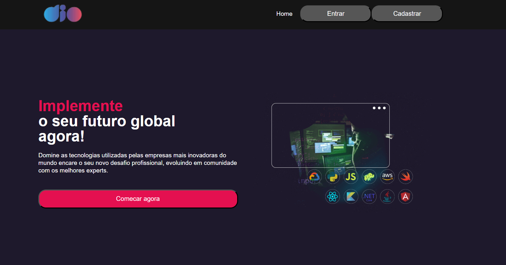
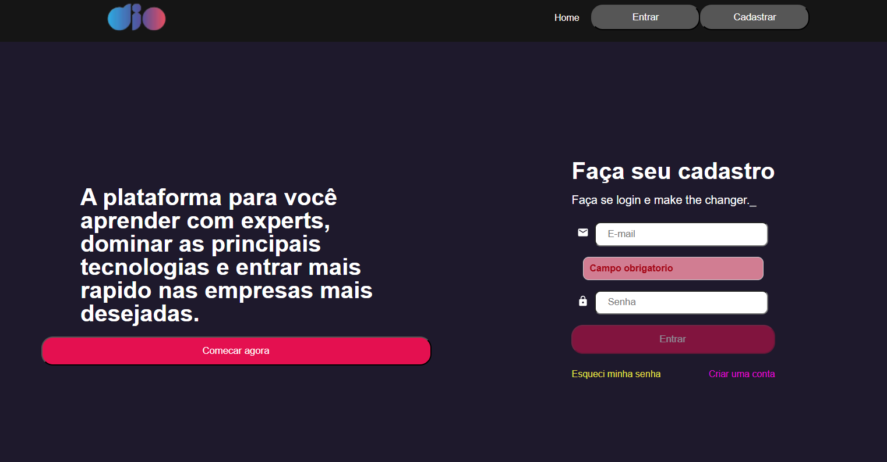
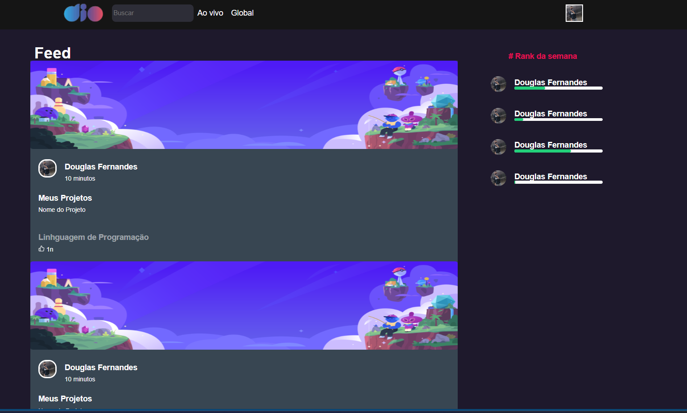

# 🚀 Digital Innovation One Simulation

Este projeto é uma simulação do site da Digital Innovation One, contendo as páginas de Login, Feed, Cadastro e Home. O projeto foi desenvolvido utilizando React, TypeScript, HTML, CSS e JavaScript, e conta com diversas bibliotecas para melhorar a funcionalidade e a experiência do usuário.

## 🌟 Funcionalidades

- 🛠️ Páginas de Login, Feed, Cadastro e Home.
- ✅ Verificação e validação de inputs para garantir a digitação correta.
- 🔐 Autenticação simulada com verificação de email e senha.
- 🎨 Estilização com styled-components para um design moderno e responsivo.
- 🧩 Utilização de React Hooks e Context API para gerenciamento de estado.

## 📚 Tecnologias e Bibliotecas Utilizadas

- ⚛️ **React**: Biblioteca JavaScript para construção de interfaces de usuário.
- 🔄 **React Router**: Biblioteca para roteamento de páginas no React.
- 💅 **styled-components**: Biblioteca para estilização com CSS-in-JS.
- 🪝 **React Hook Form**: Biblioteca para gerenciamento de formulários no React.
- 📦 **Axios**: Biblioteca para fazer requisições HTTP.
- 🛡️ **Yup**: Biblioteca para validação de schemas de JavaScript.
- 📄 **JSON Server**: Ferramenta para criar uma API REST fake com JSON.
- 📘 **TypeScript**: Superset de JavaScript que adiciona tipagem estática ao código.

## 📂 Estrutura do Projeto

## 🏠 Home


## 🔐 Login


## 📰 Feed


## 📝 Cadastro


📝 Licença

Este projeto está licenciado sob a Licença MIT. Veja o arquivo LICENSE para mais detalhes.

## 🚀 Como Executar o Projeto

1. **Clone o repositório:**
   ```sh
   git clone https://github.com/DoughFernandes/MeusProjetos/tree/Updade-Projects/Digital-Innovation-One
