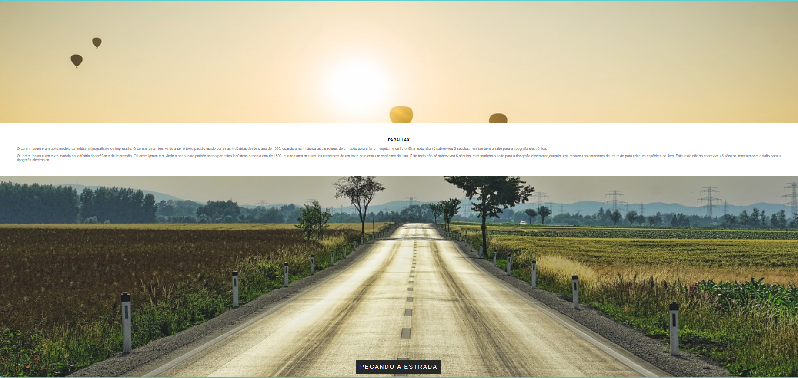

# EFEITO PARALLAX

## Ferramentas

>- ⚒️ [GitHub Desktop](https://desktop.github.com/) : Locação dos Arquivos
>- ⚒️ [VSCode Insiders](https://www.udemy.com/cart/success/950197426/) : Escrita do código
>- 🌍 [Udemy](https://www.udemy.com/) : Site do Curso
>- 🌍 [GitHub](https://github.com/) : Site do Armazenamento

### Escrita do conteúdo

### 🗓️ Data de Desenvolvimento

> | Data de Inico | Data de Finalização |
> | --- | --- |
> |05\12\2023 | 08/12/2023... |

### 🧠 Atualizacões

| Data  | Estado Projeto |
|---------------|---------------------|
| 08/12/2023 | CONCLUIDO

## ✅ Projeto Finalizado

