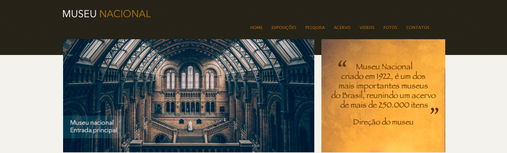
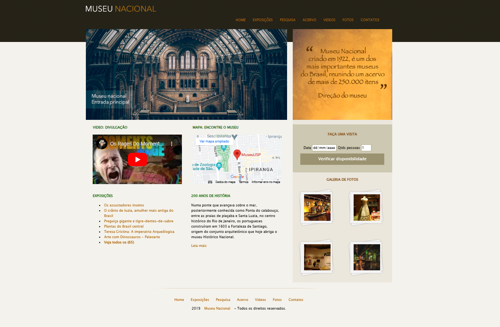

## <strong> MUSEU NACIONAL 🏯 </strong>

### ⚒️ Ferramentas
>
>- ⚒️ [GitHub Desktop](https://desktop.github.com/) : Locação dos Arquivos
>- ⚒️ [VSCode Insiders](https://www.udemy.com/cart/success/950197426/) : Escrita do código
>- 🌍 [Udemy](https://www.udemy.com/) : Site do Curso
>- 🌍 [GitHub](https://github.com/) : Site do Armazenamento

### Escrita do conteúdo

### 🗓️ Data de Desenvolvimento

> | Data de Inico | Finalização (CURSO) |
> | --- | --- |
> |15\12\2023 | Começo |
> |18\12\2023 | Fim |

### 🧠 Atualizacões

>| Datas  | Status do projeto |
>|---------------|---------------------|
>| 15/12/2023 | Estrutura do topo ||
>| 18/12/2023 | Conteúdos principal  ||
>| 18/12/2023 | Finalizado ||

## ✅ Projeto Finalizado

